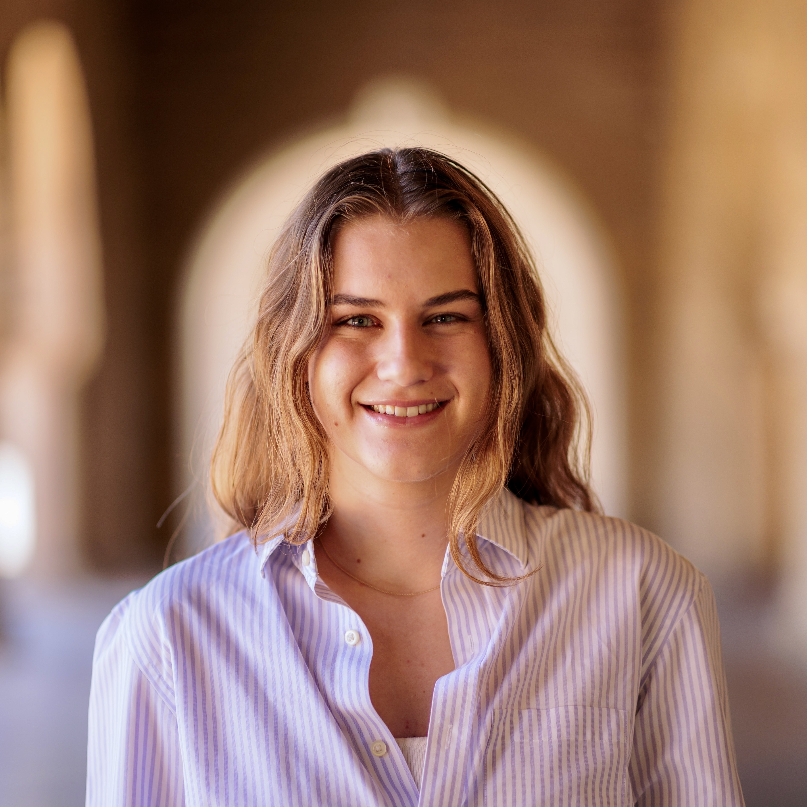

:wave: Welcome to the <strong>5th Workshop on
Computer Vision for the Built World</strong> organized at :wave:

This workshop bridges the fields of Architecture, Engineering, and Construction (AEC) with Computer Vision by focusing on how construction, the most dynamic, data-rich, and physically grounded phase of the built environment, can inform the way we design. Construction sites continuously evolve in geometry, appearance, and topology, offering a uniquely challenging yet structured setting for advancing computer vision tasks such as spatiotemporal modeling, semantic reasoning, and multimodal understanding. At the same time, the representations learned from construction data --- capturing how things are actually built, changed, and adapted --- can feed back into design processes, informing more generative, data-driven, and sustainable decision-making.

The workshop explores how visual and multimodal data, including 3D scans, imagery, sensor streams, and language, can be used to model and predict the evolution of the built environment and inspire generative frameworks that translate these insights into actionable design knowledge. The goal is to connect bottom-up scene understanding with top-down design generation, effectively closing the loop between "as-built" and "as-designed." Construction thus becomes not only an application domain but also an experimental testbed for foundational computer vision research --- providing real-world complexity, scale, and temporal dynamics rarely captured in synthetic datasets.

Through paper submissions, keynote talks, and the **Nothing Stands Still** construction-data challenge, participants will engage with real-world, challenging testbeds that advance spatiotemporal 3D modeling, multimodal understanding, and semantic reasoning of evolving scenes in core vision research.

The workshop will consist of: invited <a href="#speakers" target="_self">keynote talks</a>, <a href="#papers" target="_self">paper submissions</a>, and the <a href="#challenge" target="_self">Nothing Stands Still Challenge</a>.

---

## :newspaper: **News** {#news}
- **16 Feb 2026 ---** :tada: Website is live!

---

## :dart: **Topics** {#topics}

- **Learning from change:** Vision-based modeling of evolving spaces/sites to capture temporal, geometric, and semantic changes across scales.
- **Generative and predictive modeling:** Using construction-derived knowledge to propose design alternatives, predict project evolution, and support reuse and sustainability goals.
- **Multimodal scene understanding:** Integrating 3D geometry, imagery, building sensors, and text-based project documentation for holistic understanding.
- **Design-process feedback:** Translating as-built data into generative design prompts or constraints that make design more adaptive, data-informed, and context-aware.
- **Sustainability and circularity:** Leveraging vision and generation to enable resource-conscious construction, renovation, and reuse of building components.
- **Benchmarking and evaluation:** Introducing the Nothing Stands Still construction dataset and challenge on spatiotemporal 3D registration as a realistic testbed for evolving-scene understanding.

---

## :hourglass_flowing_sand: **Important Dates** {#dates}
> **NOTE**: The submission/release times are **11:59:59 UTC** on the specified date.

<strong><u>Archival Paper Submission (8 pages)</u></strong>
- **15 Jan 2026 ---** Submissions open
- **15 Mar 2026 ---** Submission deadline
- **20 Mar 2026 ---** Final decisions / Reviews sent
- **10 Apr 2026 ---** Camera ready deadline

<strong><u>Non-Archival Paper Submission (4 pages)</u></strong>
- **15 Jan 2026 ---** Submissions open
- **15 Apr 2026 ---** Submission deadline
- **1 May 2026 ---** Final decisions / Reviews sent

<strong><u>Nothing Stands Still Challenge</u></strong>
- **15 Jan 2026 ---** Dataset release & Registration opens
- **15 Feb 2026 ---** Submission window opens (evaluation server live)
- **30 Apr 2026 ---** Challenge submission deadline
- **30 Apr -- 4 May 2026 ---** Review & Evaluation
- **5 May 2026 ---** Notification of challenge winners
- **TBD ---** CV4AEC Workshop @ CVPR 2026

---

## :calendar: **Schedule** {#schedule}
The workshop will take place on a **date TBD** as a **half-day in-person event (4 hours)**.

> **NOTE**: The schedule is tentative. Exact times will be updated closer to the workshop date.

| Time          | Duration  | Session                                                               |
|---------------|-----------|-----------------------------------------------------------------------|
| 0:00 -- 0:10  | 10 mins   | Welcome & Introduction                                                |
| 0:10 -- 0:40  | 30 mins   | **Keynote 1**                                                         |
| 0:40 -- 1:10  | 30 mins   | **Keynote 2**                                                         |
| 1:10 -- 1:50  | 40 mins   | Challenge Winners Session (10 min intro + 30 min presentations)       |
| 1:50 -- 2:30  | 40 mins   | _Poster Session + Coffee Break_                                       |
| 2:30 -- 3:00  | 30 mins   | **Keynote 3**                                                         |
| 3:00 -- 3:30  | 30 mins   | **Keynote 4**                                                         |
| 3:30 -- 4:00  | 30 mins   | Oral Presentations (Best papers)                                      |
| 4:00          | 5-10 mins | _Conclusion & Closing Remarks_                                        |

---

## :microphone: **Keynote Speakers** {#speakers}

<figure>
    
    <b> <a href="https://www.cs.princeton.edu/~jiadeng/">Jia Deng</a>
     Professor, CS  Princeton</b>
</figure>

<figure>
    
    <b> <a href="https://engineering.nyu.edu/faculty/semiha-ergan">Semiha Ergan</a>
     Professor, CEE & CSE  NYU</b>
</figure>

<figure>
    
    <b> <a href="https://jianghz.me/">Huaizu Jiang</a>
     Assistant Professor, CS  Northeastern</b>
</figure>

<figure>
    
    <b> <a href="https://engineering.nyu.edu/faculty/debra-laefer">Debra Laefer</a>
     Professor, Urban Informatics  NYU</b>
</figure>

[**Jia Deng**](https://www.cs.princeton.edu/~jiadeng/)
is a Professor of Computer Science at Princeton University. His research focuses on computer vision and machine learning. He received his Ph.D. from Princeton University and his B.Eng. from Tsinghua University, both in computer science. He is a recipient of the Sloan Research Fellowship, the NSF CAREER award, the ONR Young Investigator award, an ICCV Marr Prize, a CVPR test-of-time award and two ECCV Best Paper Awards. His recent work demonstrates how procedural and generative approaches can create complex, realistic indoor scenes, bridging vision research and design.

[**Semiha Ergan**](https://engineering.nyu.edu/faculty/semiha-ergan)
is a faculty member at the Department of Civil and Urban Engineering and Computer Science and Engineering at New York University, and an associated faculty at the Center for Urban Science and Progress (CUSP). With her background in civil engineering, AI and informatics, she leads the Building Informatics and Visualization Lab (biLAB) at NYU Tandon School of Engineering. BiLAB specializes in utilizing cutting-edge AI and sensing technologies to tackle challenges observed during the design, construction, and operation of facilities. The research team detects, quantifies, and visualizes patterns over time, leveraging data obtained from reality capture technologies (e.g., cameras, laser scanners) and embedded sensing. By exploiting the intersection of BIM, AI, robotics, and manufacturing processes, the lab enhances the scalability and efficiency of construction methods, particularly in modular construction contexts. Her work has been supported by DOE BTO, various programs of NSF, DARPA, and private organizations. Her achievements include NYU's 2023 Distinguished Teacher Award, 2024 Inclusive Excellence Award, and 2015 DARPA Young Faculty Award.

[**Huaizu Jiang**](https://jianghz.me/)
is an assistant professor in the Khoury College of Computer Sciences at Northeastern University. His research interests include computer vision, computational photography, machine learning, natural language processing, and artificial intelligence. Prior to joining Northeastern University, he was a Postdoc Researcher at Caltech and a Visiting Researcher at NVIDIA. He obtained his Ph.D. from UMass Amherst, advised by Prof. Erik Learned-Miller. His awards include the 2019-2020 NVIDIA Graduate Fellowship, 2019 Adobe Fellowship, and 2018 Outstanding Reviewer at IEEE/CVF CVPR. His recent work demonstrates how generative vision models can transform 2D building plans into realistic 3D environments, bridging perception and design.

[**Debra Laefer**](https://engineering.nyu.edu/faculty/debra-laefer)
is a Full Professor of Urban Informatics, jointly appointed at New York University's Center for Urban Science and Progress and its Department of Civil and Urban Engineering. With degrees from the University of Illinois Urbana-Champaign (MS, Ph.D.), NYU (MEng), and Columbia University (BS, BA), Prof. Laefer has a wide-ranging urban research background applied through the lens of remote sensing, civil engineering, and historic preservation. Her work often stands at the cross-roads of technology creation and community values such as devising technical solutions for protecting architecturally significant buildings from subsurface construction and subsurface utility network generation. Prof. Laefer and her Urban Modeling Group pioneer computationally efficient storage, querying, and visualization strategies that harness distributed computing-based solutions and bridge the gap between LiDAR and hyperspectral data availability and its usability for the engineering community.

---

## :paperclip: **Call for Papers** {#papers}

We invite submissions exploring the intersection of Computer Vision and the Built Environment, focusing on applications that transform how we understand, model, and design buildings and construction sites. Construction sites and building lifecycles are dynamic, complex, and data-rich, providing an ideal real-world testbed for advancing computer vision methods while generating actionable insights for design, sustainability, and circular practices.

Both **short non-archival papers (4 pages)** and **long archival papers (8 pages)** are welcome. Submissions should:
- Introduce the topic and review related literature.
- Present methodology, experiments, and results.
- Situate the work in the context of real-world AEC applications, highlighting potential improvements over current practice.
- Include discussion of practical, ethical, and organizational considerations, when relevant.

The best two long archival papers and the best short non-archival paper will be presented during the workshop in the Oral Presentation session.

We also accept papers submitted to the main conference and accepted as long non-archival papers (8 pages). Please indicate on the manuscript submission that it is accepted at the main conference.

<strong>Topics</strong> include but are not limited to:
- Generative design and predictive modeling, including those informed by evolving data or other physical constraints.
- Floorplan reconstruction, indoor layout synthesis, and 3D scene generation.
- Activity recognition on construction sites or within occupied buildings.
- Semantic 3D/4D understanding for construction monitoring, renovation, or modular design related tasks.
- Large-scale 3D reconstruction of evolving sites and temporally dynamic environments.
- Material, component, and object understanding to support reuse and circular economy practices.
- Object and scene localization, mapping, scene completion, and change detection across evolving phases.
- Multimodal integration of 3D geometry, imagery, sensors, and text-based documentation to inform design and operational decisions.

Each submission will be reviewed by at least two program committee members, chosen to provide complementary expertise across computer vision and AEC domains.

---

## :checkered_flag: **Nothing Stands Still Challenge** {#challenge}

The workshop will host the **2026 Nothing Stands Still (NSS) Dataset Challenge**, introducing a unique real-world testbed for computer vision research. Previously run as part of a robotics conference workshop, the NSS challenge is now joining the computer vision community for the first time, reflecting its relevance for understanding complex, dynamic environments at scale. Full details from prior challenges are available at: **[nothing-stands-still.com/challenge](https://nothing-stands-still.com/challenge)**

The challenge focuses on **spatiotemporal 3D point cloud registration** of evolving construction sites, which feature dramatic changes in geometry, topology, and appearance over time. These dynamic environments make construction sites an ideal testbed for cutting-edge computer vision tasks, including scene reconstruction, semantic understanding, predictive modeling, and temporal reasoning. To expand the scope of the challenge, we aim to add semantic annotations, enabling participants to reason not only about geometry but also about functional elements, building components, and how they evolve over time.

<!--  -->
<!-- *Figure 1. The Nothing Stands Still benchmark evaluates both pairwise and multi-way spatiotemporal 3D point cloud registration.* -->

### Evaluation

- **Spatiotemporal registration task:** Submissions will be evaluated using a **global RMSE metric**, providing a standardized measure for comparing performance across methods.
- **Spatiotemporal semantic understanding task:** Methods will be evaluated on standard segmentation metrics, as well as temporal counterparts.

### Challenge Timeline

| Milestone | Date |
|-----------|------|
| Dataset Release & Registration Opens | January 15, 2026 |
| Submission Window Opens (evaluation server live) | February 15, 2026 |
| Submission Deadline | April 30, 2026 |
| Review & Evaluation | April 30 -- May 4, 2026 |
| Notification of Challenge Winners | May 5, 2026 |
| Workshop Presentation & Awards | TBD |

> **Ethical Note:** All construction sites in the dataset are located in North America, which may limit the generalization of models trained on this data. Participants are encouraged to consider methods for robust and fair modeling across varied environments.

By combining dynamic geometry, large-scale scene evolution, and future semantic reasoning, the NSS challenge offers the CV community a rigorous, high-impact platform to test algorithms in scenarios that closely mimic real-world challenges in construction, renovation, and modular building reuse --- bridging the gap between technical innovation and tangible societal impact.

---

## :question: **Questions** {#questions}
Contact the organisers at **[cv4aec.3d@gmail.com](mailto:cv4aec.3d@gmail.com)**

---

# **Organizers** {#organizers}

<figure>
    
    <b> <a href="https://ir0.github.io/">Iro Armeni</a>
     Assistant Professor  Stanford</b>
</figure>

<figure>
    
    <b> <a href="https://sayands.github.io/">Sayan Deb Sarkar</a>
     PhD  Stanford</b>
</figure>

<figure>
    
    <b> <a href="http://web.engr.oregonstate.edu/~lif/">Fuxin Li</a>
     Associate Professor  Oregon State</b>
</figure>

<figure>
    
    <b> <a href="https://cce.oregonstate.edu/olsen">Michael Olsen</a>
     Dean's Professor  Oregon State</b>
</figure>

<figure>
    
    <b> <a href="https://people.inf.ethz.ch/pomarc/">Marc Pollefeys</a>
     Professor  ETH Zurich</b>
</figure>

<figure>
    
    <b> <a href="https://www.easteine.com/">Emily Steiner</a>
     PhD  Stanford</b>
</figure>

<figure>
    
    <b> <a href="https://taosun.io">Tao Sun</a>
     PhD  Stanford</b>
</figure>

<figure>
    
    <b> <a href="https://engineering.oregonstate.edu/people/yelda-turkan">Yelda Turkan</a>
     Associate Professor  Oregon State</b>
</figure>

